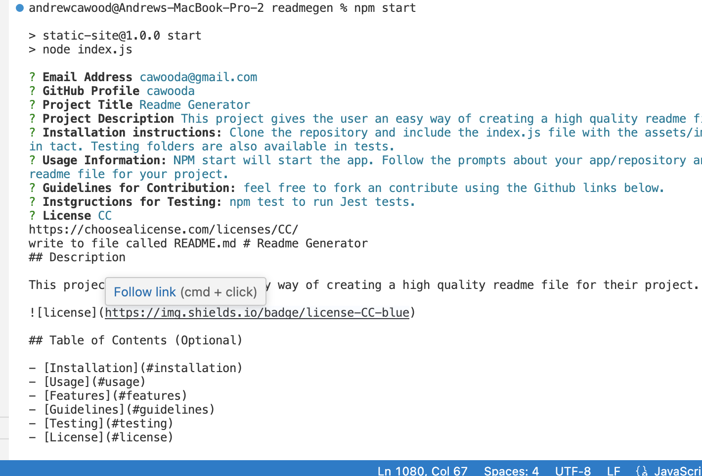

# Readme Generator
## Description

This project gives the user an easy way of creating a high quality readme file for their project.


## Table of Contents (Optional)

- [Installation](#installation)
- [Usage](#usage)
- [Features](#features)
- [Guidelines](#guidelines)
- [Testing](#testing)
- [License](#license)

## Installation Instructions

Clone the repository and include the index.js file with the assets/images and /utils folders in tact. Testing folders are also available in tests.

## Usage
NPM start will start the app. Follow the prompts about your app/repository and create a high quality readme file for your project.

### Screenshot



```md

```

## Features
undefined

## Guidelines
feel free to fork an contribute using the Github links below.

## Testing
npm test to run Jest tests.

## Questions

For questions, please contact <mailto:cawooda@gmail.com> or 

view github:
(
    [](https://github.com/cawooda)
    )
<cawooda>

## License

<https://choosealicense.com/licenses/CC/>


        
    Readme File Generator by Andrew Cawood is marked with CC0 1.0 
    ;
    

---


  